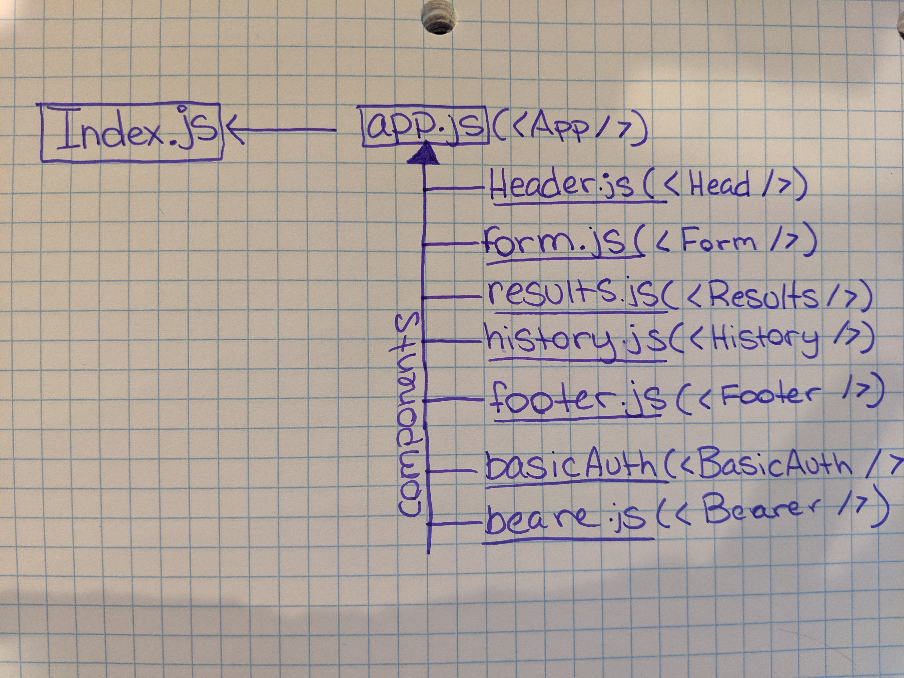

# restY 

## Author: Natalie Alway

### Links and Resources
* [submission PR](https://github.com/nataliealway-401-advanced-javascript/restY/pull/2)
* [Travis](https://www.travis-ci.com/nataliealway-401-advanced-javascript/restY)
* [jsdocs](https://github.com/nataliealway-401-advanced-javascript/restY/tree/workingBranch/docs)
* [Code Sandbox](https://codesandbox.io/s/kind-forest-zbtvc)
* [Deployment](https://workingbranch.d108shv7vkbfxg.amplifyapp.com/)

# Components
`<App />`   
`<Head />`  
`<Form />`  
`<Results />` 
`<History />` 
`<BasicAuth />` 
`<Bearer />` 

### Setup
* `npm start`
  
#### Tests
* `npm test`

#### UML

